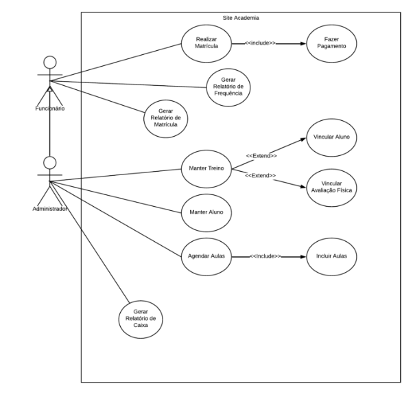

# 4. Diagrama de Caso de Uso #

## 4.1 Descrição de Caso de Uso ##

### **1)Caso de Uso:** Gerar Relatório de Frequência
**Objetivo:** Gerar um Relatório de Frequência dos funcionários 

**Atores:** Funcionário

**Pré-condição:** O sistema deve estar disponível on-line e o funcionário deve estar logado no sistema com usuário e senha válidos.

**Fluxo de Eventos:**

Funcionário: Acessar a página de relatórios.

Funcionário: Acessar a página de relatórios de Frequência

Sistema: Retorna a tela com o Relatório de Frequência

**Pós-condição:** O relatório de frequência deve ter sido gerado e apresentado ao funcionário.

------------------------------------------------------------------------------------

### **2)Caso de Uso:** Manter Aluno

**Objetivo:** Realizar o gerenciamento dos dados dos alunos, incluindo cadastro, edição, exclusão e consulta.

**Atores:** Administrador

**Pré-condição:** O sistema deve estar disponível on-line e o administrador deve estar logado no sistema com usuário e senha válidos.

**Fluxo de Eventos:**

Administrador: Acessa o link para gerenciar alunos.  

Administrador: Acessa o link para cadastrar, editar, excluir ou consultar um aluno.

**Se for cadastrar:**

Sistema: Retorna a tela com o formulário de cadastro de aluno.  

Administrador: Informa os dados do aluno (nome, data de nascimento, turma, etc.).  

Administrador: Clique em "Salvar Aluno".  

Sistema: Valida os dados informados e grava o novo aluno no sistema.

**Se for editar:**

Sistema: Retorna a lista de alunos cadastrados.  

Administrador: Seleciona o aluno que deseja editar.  

Sistema: Retorna a tela com o formulário preenchido com os dados do aluno.  

Administrador: Altera os dados necessários.  

Administrador: Clique em "Salvar Alterações".  

Sistema: valida os dados e atualiza o cadastro do aluno.

**Se for excluir:**

Sistema: Retorna a lista de alunos cadastrados.  

Administrador: Seleciona o aluno que deseja excluir.  

Administrador: Confirma a exclusão.  

Sistema: Exclui o cadastro do aluno.

**Se for consultar:**

Sistema: Retorna a lista de alunos cadastrados.  

Administrador: Seleciona o aluno para visualizar detalhes.  

Sistema: Apresenta os detalhes do aluno selecionado.

**Pós-condição:** O aluno deve ter sido cadastrado, editado, excluído ou consultado conforme a ação realizada pelo administrador.
