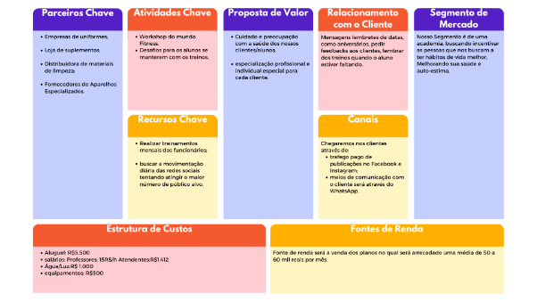

# 2. Descrição do Projeto

O projeto irá apresentar funcionalidade na qual irá auxiliar na segurança, controle e demandas internas de uma academia, auxiliando em vendas, acessos, matrículas, treinos, relatórios, entre outras demandas.

## 2.1 Visão Geral do Projeto

A academia busca proporcionar saúde e a satisfação de nossos alunos através da prática de esporte físico. A academia irá proporcionar eventos mensais e semanais  incentivando as pessoas a prática de exercícios. 

### Canvas do Projeto

## 2.1.1 Canvas do Projeto ##

## 2.2 Stakeholders ##

\- [João Arthur Dutra Basso] - [Gerente do Projeto e Membro da equipe de desenvolvimento]

\- [Ana Caroline Debastiani] - [Gerente do Projeto e Membro da equipe de desenvolvimento]

## 2.3 Objetivos ##

O objetivo do projeto é auxiliar através de um sistema, donos de academias a otimizarem e controlarem de uma forma mais ampla o seu controle sobre o seu negócio.