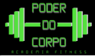

Integrantes: João Arthur Dutra Basso e Ana Caroline Debastiani

Tema: O objetivo deste trabalho é apresentar o desenvolvimento de um sistema para a academia fictícia **"Poder do Corpo Academia Fitness LTDA"**, detalhando a criação de uma solução tecnológica que visa melhorar a organização interna e a gestão de processos na academia. Este projeto envolve a elaboração de requisitos funcionais e não funcionais, a criação de diagramas de caso de uso e de classes, além de um planejamento estratégico que busca atender às necessidades específicas dos proprietários e clientes da academia. O documento serve como uma referência para o desenvolvimento e a implementação do sistema, garantindo que todos os stakeholders tenham uma compreensão clara e alinhada dos objetivos e funcionalidades propostas.